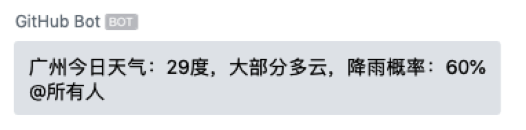
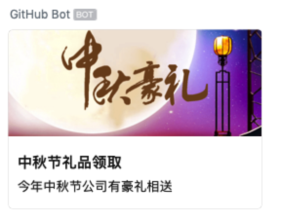

# WeChat Work for GitHub Actions

通过企业微信机器人发送消息


<hr/>

## 用法

#### 纯文本格式消息



```yaml
- name: WeChat Work notification by text
  uses: chf007/action-wechat-work@master
  env:
    WECHAT_WORK_BOT_WEBHOOK: ${{secrets.WECHAT_WORK_BOT_WEBHOOK}}
  with:
    msgtype: text
    content: 广州今日天气：29度，大部分多云，降雨概率：60%
    mentioned_list: '["wangqing","@all"]'
    mentioned_mobile_list: '["13800001111","@all"]'
```

参数 | 必须 | 说明
------------ | ------------- | -------------
msgtype | true | 消息类型，此时固定为text
content | true | 文本内容，最长不超过2048个字节，必须是utf8编码
mentioned_list | false | userid的列表，提醒群中的指定成员(@某个成员)，@all表示提醒所有人，如果开发者获取不到userid，可以使用mentioned_mobile_list，必须是序列化后的JSON字符串
mentioned_mobile_list | false | 手机号列表，提醒手机号对应的群成员(@某个成员)，@all表示提醒所有人，必须是序列化后的JSON字符串

#### markdown格式消息


```yaml
- name: WeChat Work notification by markdown
  uses: chf007/action-wechat-work@master
  env:
    WECHAT_WORK_BOT_WEBHOOK: ${{secrets.WECHAT_WORK_BOT_WEBHOOK}}
  with:
    msgtype: markdown
    content: "实时新增用户反馈<font color=\"warning\">132例</font>，请相关同事注意。\n
    > 类型:<font color=\"comment\">用户反馈</font> \n
    > 普通用户反馈:<font color=\"comment\">117例</font> \n
    > VIP用户反馈:<font color=\"comment\">15例</font>"
```

参数 | 必须 | 说明
------------ | ------------- | -------------
msgtype | true | 消息类型，此时固定为markdown
content | true | markdown内容，最长不超过4096个字节，必须是utf8编码 支持的格式详见 https://work.weixin.qq.com/api/doc#90000/90136/91770

#### 图片格式消息


```yaml
- name: WeChat Work notification by image
  uses: chf007/action-wechat-work@master
  env:
    WECHAT_WORK_BOT_WEBHOOK: ${{secrets.WECHAT_WORK_BOT_WEBHOOK}}
  with:
    msgtype: image
    base64: data:image/png;base64,iVBORw0KGgoAAAANSUhEUgAAAFcAAAAjCAYAAADhe5a7AAAGIUlEQVRoQ+2aeYiNexjHP6+syZr1jiV7KMnYd/mDyOF27Vu2kCLE7YZCws1cS4gS/rCTaxl7ZEsiRkm6V4wlxr7v+7l95+edc+bMWd73LLjNeeptZt75rd/fs3yf5/1ZBBFvamohUlJ6AT2BpsAvQIlgbfPpu1fAXeA8sJusrF1WRsanQCyswBfenj1/xetNA2rlU+Ci2XYmljXV2r17p3/nHHC9UACP509gCpAH9GhmzGd9vMBfpKf/YcFX7d0HrsezAJiazwBJxHbTrPT033PA/eYK/k5qbFyw9mJZv8lFWN+C1z9JHxsXYO1BMsnKqm95PZ4+wLa4Dh3PwXr0gFKlYNs2+PgxupH79YM3b2DvXvf9NXft2vD6NVy54qZ/X4G7ARjkptd3bbtgAdSqBb17g1cxIwpZvx4ePYLJk03nEiWgcmUoWBAKFYLChc07+ylfHipWhEqVoEwZ0+fxYxg7Fj7lYVyhFrRR4P4L1ItiybF10Ubat488xoABUKAAbNwYue3Jk/BKFDRAAsGtUQOWLAk93rNncO8ePHgAd+/CtWtw9WrwsUOPckXgvnSVIAwZAp06wc6dcOAAfP4cedPBWlSvDkuXRtc3VK8JE+DWrcjgqkX9+vD1q3k+fID376FpUxgzxmh4ZqYZp107A7D9t/MVvxK4zm2tZk1YvNg3/PXrsGKFOVW3UqQISIPCidzB6NFw9CgcOhR5hhs3DFCRNNf+v3xxq1YGTIHcoYP53Qa3ZElYvRpOnw6v6SFW5g7cJk1g5szcQ335Avv2webN8PZtZADctFAwGzUK0tLg1Ck3PWHGDGjWLG+fJ09gxAjzvnlzmD4d5s+HM2fygtu/P/TpA+PGGRfhUmIH157w4UNYtQrOnXO5BCAlBWTSgVKhApQtCzdvGrMNJnPnwkt5tgDxeHyW0bat0WitTVFfvlluQSIA79wxhydL6dgRdu0CHYKC6IsXcPiwaSu24IIxxA9cTa5orkWuWQMKCk5Fm1q0yER0HZITUbQX8MOHw9On4XsEBjRp4+DBTmbJ3WbrVti0yXG/+IJrTytN0oZ04k7okw3uli3GvTgRmWqXLtGBW7QoFCvmm0XuY9AgOHjQaPLKlSCWsm4dXLjga/fuXWgLCrLmxIBrT3TpEixbFtlf2eDKdzsl+gMHmkgejeb6A9G1KwwbBnPmQLlyvoBmWTBrFuzfD9JYxRaXklhwtRiR7/Hjwwc7G1yXi89u7gZcO8idOAFVq8LIkdCgASxfbvxwIFuoV88EcFnihg2GNYhVOJTEg6uFaFPS4lBig3vsmKFdTkQBS+bsFFwlIgJGQIm3itPqpzJAmxuLGir4yYJsP64MTYcgK7l/H6ZMcZxMJB5cN5obT5+rlDY1FVq3hjZtTJZ3/rzRQCVCSm0VdEOxkMADVpYm3itG5FASC65bn6uUU48TqVbN+MhgmquagYJR8eLGV8p/is5NmuQbWQmE/PbFi756QenSpkhz+TIoeEkEaN26MG8enD3rZGU5bRIDbrRs4fZt0ONElC1K+0K5hYkTjbnL1Sio+hduNL4N7tChhstKWrSAadMM57ZdRePGMHv2TwBurDw3nm7B/4ACee7/DtxYMjQ7oCmK63Ei3bsbn+o0oIXSXGViNheXn5YbkC+2qZdKkqrp/hC3EI/awveiYnY9119zt2/3BbUqVUz6K679/Lk5YmWCnTt/B3AD66CxVMX8tdMGd88eSE93orcm4qseHKvmJtjnuqvnajGq5+7YEVs9Nxi4ifK5KrSrqhVMcxWsVMyRNGxosrWFCw2nldSpY8qe7t1Cdj33x3yJUMVJJUyJ8nxF/2gKN6pS2QV70SqlqpJGjQybUHFHdQLRKzEBW2y24MxOogE3+0vEj/mGJgto2dLp1py1U5Kwdq1p262b+aogEfiiY8eP5wVXGmlrbrBZxHtV/3Wvudnf0H7ur7/OYM3bStagj4xiAmIEgQDK3PUcORL+q7ISFRXVMzIiF6Byr6Jv8t5CtIcXvp+5t6A2yRs3cUXYd+PGHtabvCsWL4Rz3xXL1t7kLcdYwQ19yzFHg5P3c6MBOfz9XP8RkzfLI+Lr6Gb5fxIdCIlOU4+aAAAAAElFTkSuQmCC
    md5: 9c2c8daba00a516c0ff469ca13e0edf0
```

参数 | 必须 | 说明
------------ | ------------- | -------------
msgtype | true | 消息类型，此时固定为image
base64 | true | 图片内容的base64编码 注：图片（base64编码前）最大不能超过2M，支持JPG,PNG格式
md5 | true | 图片内容（base64编码前）的md5值

#### 图文格式消息



```yaml
- name: WeChat Work notification by news
  uses: chf007/action-wechat-work@master
  env:
    WECHAT_WORK_BOT_WEBHOOK: ${{secrets.WECHAT_WORK_BOT_WEBHOOK}}
  with:
    msgtype: news
    articles: '[{"title":"中秋节礼品领取","description":"今年中秋节公司有豪礼相送","url":"URL","picurl":"http://res.mail.qq.com/node/ww/wwopenmng/images/independent/doc/test_pic_msg1.png"}]'
```
参数 | 必须 | 说明
------------ | ------------- | -------------
msgtype | true | 消息类型，此时固定为news
articles | true | 图文消息，一个图文消息支持1到8条图文，必须是序列化后的JSON字符串
articles.title | true | 标题，不超过128个字节，超过会自动截断
articles.description | false | 描述，不超过512个字节，超过会自动截断
articles.url | false | 点击后跳转的链接。
articles.picurl | false | 图文消息的图片链接，支持JPG、PNG格式，较好的效果为大图 1068*455，小图150*150。

#### 更多详细参数说明，参见 https://work.weixin.qq.com/api/doc#90000/90136/91770

## WECHAT_WORK_BOT_WEBHOOK

* **`WECHAT_WORK_BOT_WEBHOOK`**: 企业微信 Webhook URL (**required**, 参见 https://work.weixin.qq.com/api/doc#90000/90136/91770).
